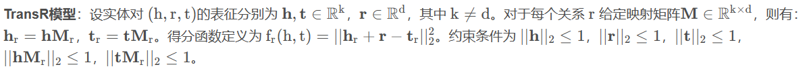

<h1 align = "center">Web 实验二 报告</h1>

> PB20071446 赵钦林 ：
>
> ​		负责代码整合，报告整合。stage1，stage2任务1、5
>
> PB20061354 黄与进：
>
> ​		负责stage1二跳子图改善、stage2 基于图谱嵌入的模型及其训练结果
>
> PB20111675 方越：
>
> ​		负责stage2 基于CNN的模型及其训练结果


## 一、图谱抽取

### 文件结构树

```
.
|-- README.md
|-- doc
|   | -- douban2fb.txt
|   | -- graph_step1.txt     <- 经过筛选的一跳子图
|   | -- graph_step2.txt     <- 经过筛选的二跳子图
|   | -- graph_step2_old.txt <- 未加tag三元组的二跳子图
|   | -- new_triplet.txt     <- tag形成的新三元组
|    ` -- tag2pinyin.txt     <- tag对应的拼音
`-- src
    | -- add_tag_item.py     <- 用于添加tag实体的程序
    | -- filter1.py          <- 用于筛选一跳子图
    | -- filter2.py          <- 用于筛选二跳子图
    | -- info_movie.json     <- 实验一的电影信息
    | -- my_statistics.py    <- 用于统计子图规模
    | -- searcher1.py        <- 用于得到一跳子图
     `-- searcher2.py        <- 用于得到二跳子图

```


### 1. 寻找对应实体

​	助教提供的文件`\doc\douban2fb.txt`中存储了电影ID与freebase实体之间的对应关系。

### 2. 获得二跳子图

#### a. 思路

​	以578个可匹配实体为起点，通过三元组得到一跳子图。对一跳子图适当筛选后以一跳子图中的实体为起点获得二跳子图，对二跳子图进行筛选后得到最终结果。

#### b. 实现

- 文件关系图如下


- 一跳子图筛选规则


​	采样 20 核的设置，即只保留了至少出现在 20 个三元组中的实体，同时只保留出现超过 50 次的关系

- 二跳子图筛选规则

  - 先进行高频过滤

  

  - 再次统计后，采样 15 核的设置，同时只保留出现大于50次的关系

  

- 子图规模

|            | 一跳子图 | 二跳子图 |
| ---------- | -------- | -------- |
| 三元组数量 | 18396    | 31751    |
| 实体数量   | 758      | 1823     |
| 关系数量   | 30       | 50       |

### 3. 添加Tag实体信息

#### a. 思路

在二跳子图中将所有的不同Tag统计出来，用拼音映射对其编码，人为构建三元组，添加到图中

#### b. 实现

- 调用`pypinyin`包将Tag映射为对应的拼音，并将结果保存到`\doc\tag2pinyin.txt`中，结果如下


- 将Tag 与 电影之间的关系命名为`film.film.type`，对每个电影及其Tag建立三元组，追加到二跳子图文件末尾，核心代码如下

```python
rela_list = []
for movie_info in movie_info_list:
    movie_id = movie_info["Id"]
    if movie_id not in id_dict:
        continue
    db_id = id_dict[movie_id]
    tags = movie_info['基本信息']['类型']
    for tag in tags:
        pinyin = pinyin_dict[tag]
        rela_list.append([db_id, pinyin])
```

### 4. Tag实体对齐

​	在该任务中，Tag实体没有什么属性可以利用，也利用不了什么三元组信息，进而实体对齐任务在该场景下就会演化为同近义词合并，所以没有进行这部分工作。

----------------------------------------------------------------------------------------------------------------------------------


## 二、图谱推荐

### 文件结构树

```tree
.
|-- doc
|   | -- graph_step2_new.txt  <- 加入tag实体形成的三元组后的二跳子图
|   | -- map_item_index.txt   <- 电影实体与索引的映射文件
|   | -- map_rela_index.txt   <- 关系与索引的映射文件
|   | -- movie_id_map.txt     <- 电影id与索引的映射文件
|    `-- user_id_map.txt      <- 用户id与索引的映射文件
|-- src
|   `-- id2index.py           <- 用于将电影id对应到索引上
|-- stage (不再展示)

```


### 1. 映射为新三元组

​	利用`doc/movie_id_map.txt`文件和`douban2fb.txt`将freebase实体映射到对应的索引

```python
db_index_map = {}
for key, value in db_id_map.items():
    db_index_map[key] = movie_id_map[value]
```

​	将其余实体映射到后面的索引值，将关系映射到对应的索引区间。

​	将原来的三元组映射为新的索引三元组，结果如下所示：


### 2. MF模型

​	理解并运行，结果在下面展示。

### 3.基于图谱嵌入的模型

基于baseline代码框架, 完成基于图谱嵌入的模型, 包括数据加载部分`loader_Embedding_based.py`和模型搭建部分`Embedding_based.py`

#### a. 在 loader_Embedding_based.py 中按要求实现 KG 的构建

需要补全的是文件里的construct_data函数:

```python
class DataLoader(DataLoaderBase):
    
	def construct_data(self, kg_data):
        """
            kg_data 为 DataFrame 类型
        """
        # 1. 为KG添加逆向三元组，即对于KG中任意三元组(h, r, t)，添加逆向三元组 (t, r+n_relations, h)，
        #    并将原三元组和逆向三元组拼接为新的DataFrame，保存在 self.kg_data 中。

        # 此处可能需要将字符串转换成整数, 不需要
        temp = kg_data.copy(deep=True)
        print(type(temp.iat[0,0])) # 输出<class 'numpy.int64'>
        n_relations = 50  # 从map_rala_index.txt里找到的
        entry_number = len(temp)
        entities = []
        relations = []
        for number in range(0, entry_number):
            h = temp.iat[number, 0]
            r = temp.iat[number, 1]
            t = temp.iat[number, 2]
            if h not in entities:
                entities.append(h)
            if t not in entities:
                entities.append(t)
            if r not in relations:
                relations.append(r)
            temp.iat[number, 0] = t
            temp.iat[number, 1] = r + n_relations
            temp.iat[number, 2] = h
        if len(relations) != n_relations:
            print("relation number is not 50! It is", len(relations))
        kg_data = pd.concat([kg_data, temp], axis=0, ignore_index=True)
        print('min in entities is', min(entities), 'max is', max(entities), 'length of entities is', len(entities))
        # 0, 1837, 1828

        # 2. 计算关系数，实体数和三元组的数量
        self.n_relations = n_relations * 2
        self.n_entities = max(entities) + 1
        self.n_kg_data = len(kg_data)
        print("kg_data length is", self.n_kg_data, 2*entry_number)

        # 3. 根据 self.kg_data 构建字典 self.kg_dict ，其中key为h, value为tuple(t, r)，
        #    和字典 self.relation_dict，其中key为r, value为tuple(h, t)。
        self.kg_dict = collections.defaultdict(list)
        # 已经构造好了吗？但凡查一下defaultdict()的用法也不会这样问
        # 遇到不存在的key返回空列表
        self.relation_dict = collections.defaultdict(list)
        for i in range(0, self.n_kg_data):
            head = kg_data.iat[i, 0]
            relation = kg_data.iat[i, 1]
            tail = kg_data.iat[i, 2]
            self.kg_dict[head].append(tuple([tail, relation]))
            self.relation_dict[relation].append(tuple([head, tail]))
```

代码补全思路与重点：

（1）获取DataFrame指定位置的元素使用的是`iat`方法，两个DataFrame拼接使用的是`pd.concat`函数。

（2）为获取`n_entities`的值，一开始的方法是遍历`kg_data`，将新出现的元素放入临时的列表里，然后获取列表长度，但是运行时报错索引值超出允许范围，检查后发现并不是0到`max(entities)`中的每一个都出现过，所以`n_entities`用`max(entities)+1`来表示。

（3）`n_relations`通过查看`map_rala_index.txt`文件里最大的`relation_id`得到，为了防止出错，在遍历`kg_data`过程中统计`relation`的数量并在之后检验是否相等，运行过程中没有出现错误。

（4）`n_kg_data`的值用`len(kg_data)`获取拼接后的`kg_data`长度就可以得到。

（5）构造字典时，按照注释说的要求遍历`kg_data`并将相应的元素组成key和元组加入字典即可

#### b. 在 Embedding_based.py 中实现TransE，TransR算法，并尝试多种方法为物品嵌入注入图谱实体的语义信息

- ##### TansR算法


```python
class Embedding_based(nn.Module):
	
	    def calc_kg_loss_TransR(self, h, r, pos_t, neg_t):
        """
        h:      (kg_batch_size)
        r:      (kg_batch_size)
        pos_t:  (kg_batch_size)
        neg_t:  (kg_batch_size)
        """
        r_embed = self.relation_embed(r)                                                # (kg_batch_size, relation_dim)
        W_r = self.trans_M[r]                                                           # (kg_batch_size, embed_dim, relation_dim)

        h_embed = self.entity_embed(h)                                                  # (kg_batch_size, embed_dim)
        pos_t_embed = self.entity_embed(pos_t)                                          # (kg_batch_size, embed_dim)
        neg_t_embed = self.entity_embed(neg_t)                                          # (kg_batch_size, embed_dim)

        # 1. 计算头实体，尾实体和负采样的尾实体在对应关系空间中的投影嵌入
        r_mul_h = torch.sum(h_embed.unsqueeze(-1) * W_r, dim=1)                         # (kg_batch_size, relation_dim)
        r_mul_pos_t = torch.sum(pos_t_embed.unsqueeze(-1) * W_r, dim=1)                 # (kg_batch_size, relation_dim)
        r_mul_neg_t = torch.sum(neg_t_embed.unsqueeze(-1) * W_r, dim=1)                 # (kg_batch_size, relation_dim)

        # 2. 对关系嵌入，头实体嵌入，尾实体嵌入，负采样的尾实体嵌入进行L2范数归一化, 都是(kg_batch_size, relation_dim)规模的张量
        r_embed = r_embed / torch.sqrt(torch.sum(torch.pow(r_embed, 2), dim=1, keepdim=True))
        r_mul_h = r_mul_h / torch.sqrt(torch.sum(torch.pow(r_mul_h, 2), dim=1, keepdim=True))
        r_mul_pos_t = r_mul_pos_t / torch.sqrt(torch.sum(torch.pow(r_mul_pos_t, 2), dim=1, keepdim=True))
        r_mul_neg_t = r_mul_neg_t / torch.sqrt(torch.sum(torch.pow(r_mul_neg_t, 2), dim=1, keepdim=True))

        # 3. 分别计算正样本三元组 (h_embed, r_embed, pos_t_embed) 和负样本三元组 (h_embed, r_embed, neg_t_embed) 的得分
        # |h + r -t|^2
        pos_score = torch.sum(torch.pow(r_mul_h + r_embed -r_mul_pos_t, 2), dim=1, keepdim=False)
        # (kg_batch_size)
        neg_score = torch.sum(torch.pow(r_mul_h + r_embed -r_mul_neg_t, 2), dim=1, keepdim=False)                                                                    
        # (kg_batch_size)

        # 4. 使用 BPR Loss 进行优化，尽可能使负样本的得分大于正样本的得分
        kg_loss = (-1.0) * F.logsigmoid(pos_score - neg_score)
        kg_loss = torch.mean(kg_loss)

        l2_loss = _L2_loss_mean(r_mul_h) + _L2_loss_mean(r_embed) + _L2_loss_mean(r_mul_pos_t) + _L2_loss_mean(r_mul_neg_t)
        loss = kg_loss + self.kg_l2loss_lambda * l2_loss
        return loss
```

代码补全思路与重点：

（1）查阅网上资料，TransR算法过程如下：



代码中的`W_r`可以看做是上图中矩阵$M_r$的集合，上图的h对应`h_embed`，t对应`pos_t_embed`或`neg_t_embed`，$h_r$对应代码里的`r_mul_h`，$t_r$对应代码里的`r_mul_neg_t`或`r_mul_pos_t`

（2）使用`torch.sum`，`torch.sqrt`，`torch.pow`函数便能进行矩阵相乘、求L2范数等操作。

（3）在计算投影的时候，为了能让张量直接相乘，使用了`unsqueeze`方法扩展实体张量的维度。

（4）BPR Loss的计算方法与`KG_free.py`一样。

- ##### TransE算法


TransE算法相比TransR算法来说少了投影步骤，其他部分非常相似。

```python
class Embedding_based(nn.Module):

	def calc_kg_loss_TransE(self, h, r, pos_t, neg_t):
        """
        h:      (kg_batch_size)
        r:      (kg_batch_size)
        pos_t:  (kg_batch_size)
        neg_t:  (kg_batch_size)
        """
        r_embed = self.relation_embed(r)                                                # (kg_batch_size, relation_dim)
        
        h_embed = self.entity_embed(h)                                                  # (kg_batch_size, embed_dim)
        pos_t_embed = self.entity_embed(pos_t)                                          # (kg_batch_size, embed_dim)
        neg_t_embed = self.entity_embed(neg_t)                                          # (kg_batch_size, embed_dim)

        # 5. 对关系嵌入，头实体嵌入，尾实体嵌入，负采样的尾实体嵌入进行L2范数归一化
        r_embed = r_embed / torch.sqrt(torch.sum(torch.pow(r_embed, 2), dim=1, keepdim=True))
        h_embed = h_embed / torch.sqrt(torch.sum(torch.pow(h_embed, 2), dim=1, keepdim=True))
        pos_t_embed = pos_t_embed / torch.sqrt(torch.sum(torch.pow(pos_t_embed, 2), dim=1, keepdim=True))
        neg_t_embed = neg_t_embed / torch.sqrt(torch.sum(torch.pow(neg_t_embed, 2), dim=1, keepdim=True))

        # 6. 分别计算正样本三元组 (h_embed, r_embed, pos_t_embed) 和负样本三元组 (h_embed, r_embed, neg_t_embed) 的得分
        pos_score = torch.sum(torch.pow(h_embed + r_embed - pos_t_embed, 2), dim=1, keepdim=False)                                                                     
        # (kg_batch_size)
        neg_score = torch.sum(torch.pow(h_embed + r_embed - neg_t_embed, 2), dim=1, keepdim=False)                                                                     
        # (kg_batch_size)

        # 7. 使用 BPR Loss 进行优化，尽可能使负样本的得分大于正样本的得分
        kg_loss = (-1.0) * F.logsigmoid(pos_score - neg_score)
        kg_loss = torch.mean(kg_loss) 

        l2_loss = _L2_loss_mean(h_embed) + _L2_loss_mean(r_embed) + _L2_loss_mean(pos_t_embed) + _L2_loss_mean(neg_t_embed)
        loss = kg_loss + self.kg_l2loss_lambda * l2_loss
        return loss
```

- ##### 为物品嵌入注入图谱实体的语义信息

```python
class Embedding_based(nn.Module):

	def calc_cf_loss(self, user_ids, item_pos_ids, item_neg_ids):
        """
        user_ids:       (cf_batch_size)
        item_pos_ids:   (cf_batch_size)
        item_neg_ids:   (cf_batch_size)
        """
        user_embed = self.user_embed(user_ids)                                          # (cf_batch_size, embed_dim)
        item_pos_embed = self.item_embed(item_pos_ids)                                  # (cf_batch_size, embed_dim)
        item_neg_embed = self.item_embed(item_neg_ids)                                  # (cf_batch_size, embed_dim)

        item_pos_kg_embed = self.entity_embed(item_pos_ids)                             # (cf_batch_size, embed_dim)
        item_neg_kg_embed = self.entity_embed(item_neg_ids)                             # (cf_batch_size, embed_dim)
        
        # 8. 为 物品嵌入 注入 实体嵌入的语义信息, 此处采用相加的方法
        item_pos_cf_embed = item_pos_embed + item_pos_kg_embed                          # (cf_batch_size, embed_dim)
        item_neg_cf_embed = item_neg_embed + item_neg_kg_embed                          # (cf_batch_size, embed_dim)

        # 逐元素相乘
        # item_pos_cf_embed = item_pos_embed * item_pos_kg_embed
        # item_neg_cf_embed = item_neg_embed * item_neg_kg_embed

        # 拼接
        # item_pos_cf_embed = torch.cat((item_pos_embed, item_pos_kg_embed), 1)
        # item_neg_cf_embed = torch.cat((item_neg_embed, item_neg_kg_embed), 1)
        # user_embed = torch.cat((user_embed, user_embed), 1)

        pos_score = torch.sum(user_embed * item_pos_cf_embed, dim=1)                    # (cf_batch_size)
        neg_score = torch.sum(user_embed * item_neg_cf_embed, dim=1)                    # (cf_batch_size)

        cf_loss = (-1.0) * torch.log(1e-10 + F.sigmoid(pos_score - neg_score))
        cf_loss = torch.mean(cf_loss)

        l2_loss = _L2_loss_mean(user_embed) + _L2_loss_mean(item_pos_cf_embed) + _L2_loss_mean(item_neg_cf_embed)
        loss = cf_loss + self.cf_l2loss_lambda * l2_loss
        return loss
```

代码补全思路与重点：

（1）相加和逐元素相乘的方法都比较简答，由于相同规模的张量加法(+)与乘法(*)运算是逐元素的，所以直接将`item_*_embed`与`item_*_kg_embed`相加或相乘即可。

（2）拼接操作采取将`item_*_embed`与`item_*_kg_embed`在1维拼接的方法，由于拼接之后张量的规模为(cf_batch_size, 2embed_dim)，所以将`user_embed`与自己也进行在1维上的拼接，这样保证了张量规模相同能够相乘。

#### c. 多任务方式优化

​	源代码采用多任务方式，即将cf和kg loss相加，进行优化

#### d. 迭代方式优化

​	参考GNN代码，在`main_Embedding_based.py`中对cf和kg损失进行迭代优化。代码与GNN对应部分大致相同。

#### e. 尝试改进模型

阅读实验文档链接指向的综述后发现，TransE和TransR算法都有自己的缺点，于是想尝试将两种算法都运行一遍，然后将结果综合起来。修改`Embedding_based.py`中的`calc_loss`函数：

```python
class Embedding_based(nn.Module):
    
    def calc_loss(self, user_ids, item_pos_ids, item_neg_ids, h, r, pos_t, neg_t):
        """
        user_ids:       (cf_batch_size) 括号里的数是张量的长度
        item_pos_ids:   (cf_batch_size)
        item_neg_ids:   (cf_batch_size)

        h:              (kg_batch_size)
        r:              (kg_batch_size)
        pos_t:          (kg_batch_size)
        neg_t:          (kg_batch_size)
        """
        # if self.KG_embedding_type == 'TransR':
        #     calc_kg_loss = self.calc_kg_loss_TransR
        # elif self.KG_embedding_type == 'TransE':
        #     calc_kg_loss = self.calc_kg_loss_TransE
        # kg_loss = calc_kg_loss(h, r, pos_t, neg_t)
        
        kg_loss = (self.calc_kg_loss_TransE(h, r, pos_t, neg_t) + self.calc_kg_loss_TransR(h, r, pos_t, neg_t)) * 0.5
        cf_loss = self.calc_cf_loss(user_ids, item_pos_ids, item_neg_ids)
        
        loss = kg_loss + cf_loss # 将KG loss和CF loss相加的方法
        return loss
```

代码说明：

（1）注释掉的是原有的代码，新的kg_loss采用TransR和TransE算法运行结果取平均值的方法获得。

（2）最终运行结果为

```shell
Precision [0.2908, 0.2506], Recall [0.0677, 0.1095], NDCG [0.3036, 0.2779]
```


### 4. 基于 baseline 框架代码，完成基于 GNN 的模型

#### a. 在 loader_Embedding_based.py 按要求实现 KG 的构建和归一化拉普拉斯矩阵的计算。

* KG 的构建：

  ```python
  # 1. 构造新的 kg_data
  org_kg = kg_data.copy()
  n_relations = len(kg_data["r"].unique())  # 50
  kg_data['r'] = list(kg_data['r'].map(lambda x: x + n_relations))
  kg_data[['h', 't']] = kg_data[['t', 'h']]
  kg_data = pd.concat([org_kg, kg_data], ignore_index=True)
  # 2. 计算关系数，实体数，实体和用户的总数
  self.n_relations = len(kg_data['r'].unique()) + 2
  self.n_entities = max(pd.concat([kg_data["h"], kg_data['t']], ignore_index=True)) + 1
  self.n_users_entities = len(self.train_user_dict) + self.n_entities
  # 3. 修改用户索引，保留原有数据结构
  test_t = self.cf_test_data
  train_t = list(train_t)
  test_t = list(test_t)
  train_t[0] = np.array(list(map(lambda x: x + self.n_entities, train_t[0])), dtype=np.int32)
  test_t[0] = np.array(list(map(lambda x: x + self.n_entities, test_t[0])), dtype=np.int32)
  self.cf_train_data = tuple(train_t)
  self.cf_test_data = tuple(test_t)
  # 4. 修改用户字典，保留原有数据结构
  user_list = self.train_user_dict.keys()
  user_list = list(map(lambda x: x + self.n_entities, user_list))
  self.train_user_dict = dict(zip(user_list, self.train_user_dict.values()))
  self.test_user_dict = dict(zip(user_list, self.test_user_dict.values()))
  # 5. 以三元组的形式 (user, 0, movie) 重构交互数据
  cf2kg_train_data = pd.DataFrame(np.zeros((self.n_cf_train, 3), dtype=np.int32), columns=['h', 'r', 't'])
  cf2kg_train_data['h'] = self.cf_train_data[0]
  cf2kg_train_data['t'] = self.cf_train_data[1]
  # 6. 以三元组的形式 (movie, 1, user) 重构逆向的交互数据
  inverse_cf2kg_train_data = pd.DataFrame(np.zeros((self.n_cf_train, 3), dtype=np.int32), columns=['h', 'r', 't'])
  inverse_cf2kg_train_data['h'] = self.cf_train_data[1]
  inverse_cf2kg_train_data['t'] = self.cf_train_data[0]
  inverse_cf2kg_train_data['r'] = 1
  # 7. 根据 self.kg_train_data 构建字典 self.train_kg_dict
      self.train_kg_dict = collections.defaultdict(list)
      self.train_relation_dict = collections.defaultdict(list)
      for i in range(len(self.kg_train_data)):
          self.train_kg_dict[self.kg_train_data.iloc[i, 0]].append(
              (self.kg_train_data.iloc[i, 2], self.kg_train_data.iloc[i, 1]))
          self.train_relation_dict[self.kg_train_data.iloc[i, 1]].append(
              (self.kg_train_data.iloc[i, 0], self.kg_train_data.iloc[i, 2]))
  ```

* 归一化拉普拉斯矩阵的计算：

  ```python
  # 8. 根据对称归一化拉普拉斯矩阵的计算代码，补全随机游走归一化拉普拉斯矩阵的计算代码
  rowsum = np.array(adj.sum(axis=1))
  d_inv = np.power(rowsum, -1.0).flatten()
  d_inv[np.isinf(d_inv)] = 0
  d_mat_inv = sp.diags(d_inv)
  ```

#### b. 在 GNN_based.py 中实现 TransE，TransR 算法；完成图卷积模块，中心 节点表征与一跳领域表征三种聚合方式的代码。

* 一跳领域表征三种聚合方式：

  ```python
  # 1. Equation (3) 得到一跳邻域的表征 side_embeddings
  side_embeddings = torch.matmul(A_in, ego_embeddings)
  
  if self.aggregator_type == 'gcn':
  embeddings = ego_embeddings + side_embeddings  
  embeddings = self.activation(self.linear(embeddings)) 
  
  elif self.aggregator_type == 'graphsage'
  embeddings = torch.cat((ego_embeddings, side_embeddings), 1)  
  embeddings = self.activation(self.linear(embeddings))
  
  elif self.aggregator_type == 'lightgcn':
  embeddings = ego_embeddings + side_embeddings
  ```

* 完成图卷积模块：

  ```python
  # 5. 迭代地计算每一层卷积层的实体（包含用户）嵌入，将其L2范数归一化后，append到all_embed中
  for idx, layer in enumerate(self.aggregator_layers):
      ego_embed = layer(ego_embed, self.A_in)
      ego_embed = torch.div(ego_embed, torch.norm(ego_embed, p=2, dim=-1, keepdim=True))
      all_embed.append(ego_embed)
  ```

* 计算 kg_loss_TransR：

  ```python
  def get_kg_score_R(h_e, r_e, t_e):
      kg_score = torch.sum(torch.pow((h_e + r_e - t_e), 2), dim=1, keepdim=True)
      return kg_score
  
  # 7. 计算头实体，尾实体和负采样的尾实体在对应关系空间中的投影嵌入
  r_mul_h = torch.sum(h_embed.unsqueeze(-1) * W_r, dim=1)
  r_mul_pos_t = torch.sum(pos_t_embed.unsqueeze(-1) * W_r, dim=1)
  r_mul_neg_t = torch.sum(neg_t_embed.unsqueeze(-1) * W_r, dim=1)
  # 8. 对关系嵌入，头实体嵌入，尾实体嵌入，负采样的尾实体嵌入进行L2范数归一化
  r_embed = F.normalize(r_embed, 2)
  r_mul_h = F.normalize(r_mul_h, 2)
  r_mul_pos_t = F.normalize(r_mul_pos_t, 2)
  r_mul_neg_t = F.normalize(r_mul_neg_t, 2)
  # 9. 分别计算正样本三元组 (h_embed, r_embed, pos_t_embed) 和负样本三元组 (h_embed, r_embed, neg_t_embed) 的得分
  pos_score = get_kg_score_R(h_embed, r_embed, pos_t_embed)
  neg_score = get_kg_score_R(h_embed, r_embed, neg_t_embed)
  # print("shape of pos_score: ", pos_score.shape)
  # 10. 使用 BPR Loss 进行优化，尽可能使负样本的得分大于正样本的得分
  kg_loss = (-1.0) * F.logsigmoid(pos_score - neg_score)
  kg_loss = torch.mean(kg_loss)
  ```

* 计算 kg_loss_TransE：

  ```python
  def get_kg_score_E(h_e, r_e, t_e):
      kg_score = torch.sum(torch.pow(h_e + r_e - t_e, 2), dim=1, keepdim=True)
      return kg_score
  
  # 11. 对关系嵌入，头实体嵌入，尾实体嵌入，负采样的尾实体嵌入进行L2范数归一化
  r_embed = F.normalize(r_embed, 2)
  h_embed = F.normalize(h_embed, 2)
  pos_t_embed = F.normalize(pos_t_embed, 2)
  neg_t_embed = F.normalize(neg_t_embed, 2)
  # 12. 分别计算正样本三元组 (h_embed, r_embed, pos_t_embed) 和负样本三元组 (h_embed, r_embed, neg_t_embed) 的得分
  pos_score = get_kg_score_E(h_embed, r_embed, pos_t_embed)
  neg_score = get_kg_score_E(h_embed, r_embed, neg_t_embed)
  # 13. 使用 BPR Loss 进行优化，尽可能使负样本的得分大于正样本的得分
  kg_loss = (-1.0) * F.logsigmoid(pos_score - neg_score)
  kg_loss = torch.mean(kg_loss)
  ```

#### c. 多任务方式优化

​	参考`Embedding_base.py`，在`GNN_based.py`中设置loss函数，用于计算cf和kg的loss和。代码如下

```python
 # 相加模式新增函数
def calc_loss(self, user_ids, item_pos_ids, item_neg_ids, h, r, pos_t, neg_t):
    if self.KG_embedding_type == 'TransR':
        calc_kg_loss = self.calc_kg_loss_TransR
    elif self.KG_embedding_type == 'TransE':
        calc_kg_loss = self.calc_kg_loss_TransE

    kg_loss = calc_kg_loss(h, r, pos_t, neg_t)
    cf_loss = self.calc_cf_loss(user_ids, item_pos_ids, item_neg_ids)

    loss = kg_loss + cf_loss  # 将KG loss和CF loss相加的方法
    return loss
```

​	对应修改`main_GNN_based.py`中的优化方式即可。

#### d. 调研上述综述，思考如何改进自己的模型，再动手尝试

​	阅读 GNN 相关的综述[^1]，本篇综述指出了各种不同的 GNN 变体。这里我们根据实验文档中引用的论文[^2]，根据论文中的思路将 aggregator 改为双向交互聚合器（Bi-Interaction），这个考虑了$e_h$与$e_{N_h}$之间的两种功能交互。代码实现如下：

* 修改 GNN_based.py 文件中的`__init__()` 函数，在最后添加 `self.aggregator_type` ：

  ```python
  def __init__(self, embed_dim, dropout, aggregator_type):
      super(Aggregator, self).__init__()
      self.embed_dim = embed_dim
      self.dropout = dropout
      self.aggregator_type = aggregator_type
  
      # 激活初始化(非线性)
      self.message_dropout = nn.Dropout(dropout)
      self.activation = nn.LeakyReLU()
  
      # 线性变换
      if self.aggregator_type == 'gcn':
      self.linear = nn.Linear(self.embed_dim, self.embed_dim)  # W in Equation (6)
      nn.init.xavier_uniform_(self.linear.weight)
  
      elif self.aggregator_type == 'graphsage':
      self.linear = nn.Linear(self.embed_dim * 2, self.embed_dim)  # W in Equation (7)
      nn.init.xavier_uniform_(self.linear.weight)
  	
  	# TODO: 新添加的聚合器
      elif self.aggregator_type == 'bi-interaction':
      self.linear1 = nn.Linear(self.embed_dim, self.embed_dim)      # W1 in Equation (8)
      self.linear2 = nn.Linear(self.embed_dim, self.embed_dim)      # W2 in Equation (8)
      nn.init.xavier_uniform_(self.linear1.weight)
      nn.init.xavier_uniform_(self.linear2.weight)
  ```

* 修改`forward()`函数，在最后添加对 bi-interaction 类型的处理：

  ```python
  def forward(self, ego_embeddings, A_in):
  
  	side_embeddings = torch.matmul(A_in, ego_embeddings)
  
      if self.aggregator_type == 'gcn':
          embeddings = ego_embeddings + side_embeddings
          embeddings = self.activation(self.linear(embeddings))
  
      elif self.aggregator_type == 'graphsage':
          embeddings = torch.cat((ego_embeddings, side_embeddings), 1)
          embeddings = self.activation(self.linear(embeddings)) 
  
      elif self.aggregator_type == 'lightgcn':
          embeddings = ego_embeddings + side_embeddings
  
      elif self.aggregator_type == 'bi-interaction':
      # TODO: 尝试优化模型, equation(8) & (9)
          sum_embeddings = self.activation(self.linear1(ego_embeddings + side_embeddings))
          bi_embeddings = self.activation(self.linear2(ego_embeddings * side_embeddings))
      	embeddings = bi_embeddings + sum_embeddings
  
      embeddings = self.message_dropout(embeddings)  # (n_users + n_entities, out_dim)
      return embeddings
  ```

执行`./main_GNN_based.py --aggregation_type=bi-interaction`，得到最终结果为

```shell
Precision [0.3177, 0.2729], Recall [0.0771, 0.1272], NDCG [0.3336, 0.3057]
```

[^1]: [[PDF\] The Graph Neural Network Model | Semantic Scholar](https://www.semanticscholar.org/paper/The-Graph-Neural-Network-Model-Scarselli-Gori/3efd851140aa28e95221b55fcc5659eea97b172d)
[^2]: [KGAT: Knowledge Graph Attention Network for Recommendation (arxiv.org)](https://arxiv.org/pdf/1905.07854.pdf)


### 5. 对比 & 分析

#### a. Embedding 相关结果如下

- 多任务模式


- 迭代模式


通过对比可得到以下几点

- 图谱嵌入方式
  - add和 cat 的结果要大幅好于mul
  - add 和 cat 结果高度相似。
    - 原因是在设计时cat和add在本质上没什么区别
- 训练方式
  - 对结果影响不大

#### b. GNN的相关结果如下所示

- 多任务模式


- 迭代模式


**高清图片见assert文件夹**

通过对比可以得到以下几点

- 训练方式
  - 采用迭代优化的方式最终结果要好于多任务方式，但差异不是很明显
- 图卷积聚合方式
  - lightgcn效果最好
    - lightgcn保留了gcn核心的邻域聚合组件，同时对其进行了精简，使其更适合推荐
  - gcn受训练方式影响较大，在多任务方式下效果很好，在迭代方式下效果很差
    - gcn中的特征变换和非线性激活这两个标准操作，不可避免地增加了训练的难度
- 在许多组合中 TransE + lightgcn平均结果最好（图中绿色的线）

#### c. 层数对GNN的影响


- 当layer为1（图中蓝色线）的时候效果最好，随着层数增加效果下降。
  - 效果下降的原因为GNN中layer过多导致过平滑问题发生

#### d. 三种方式的比较


- 三种方式中GNN最优，各种指标大幅高于其他两种方法
- Embedding方式和KG_free相差不多

